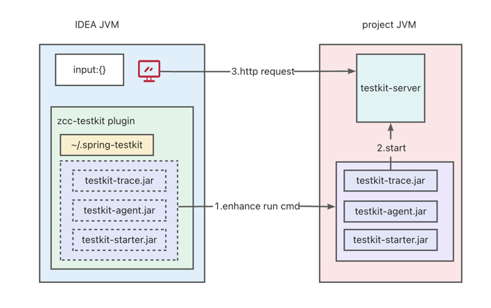

**提升 Spring 项目研发效率的解决方案，提供对常见框架调试增强**

## 🚀 效能组件
- **Function-call** - 运行时方法级调试
- **Flexible-test** - 动态编译代码及调试

## 🚀 框架增强
- **Mapper-sql** - 根据mapper-xml动态生成sql
- **Controller-command** - 可定制化Controller脚本
- **FeignClient-command** - 可定制化FeignClient脚本
- **Spring-cache** - 可视化调试Spring-cache

## 📦 研发支撑
- **Trace** - 可视化请求链路
- **SQL-tool** - Sql-reviewer & DDL-execute
- **Coding-guidelines** - 角标指引式研发提醒
- **Realtime-view-value** - 实时观测bean的字段内容
- **Curl-parser** - 简易curl解析器

## 🔨Infra
