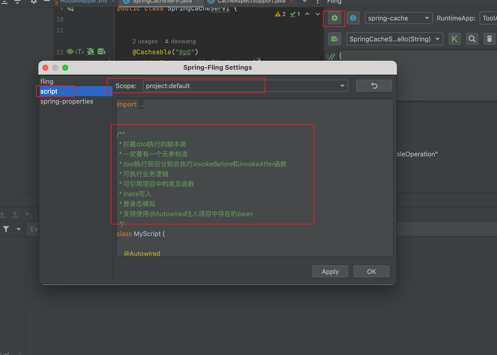
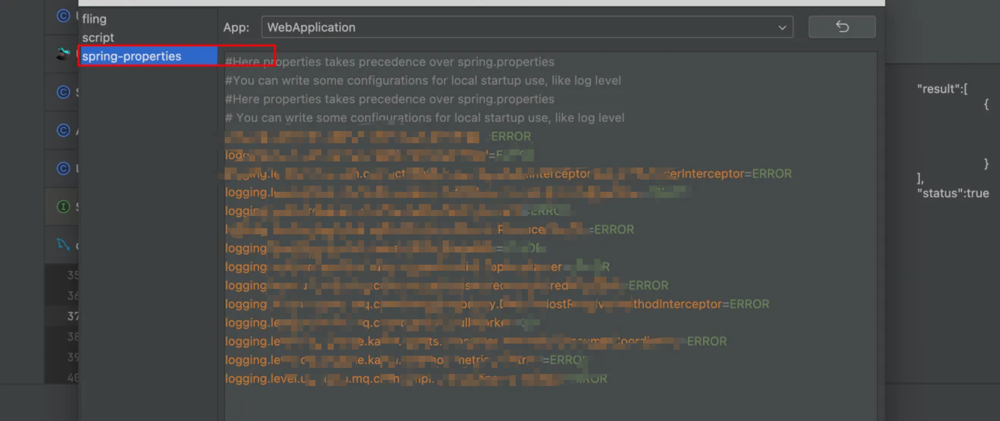
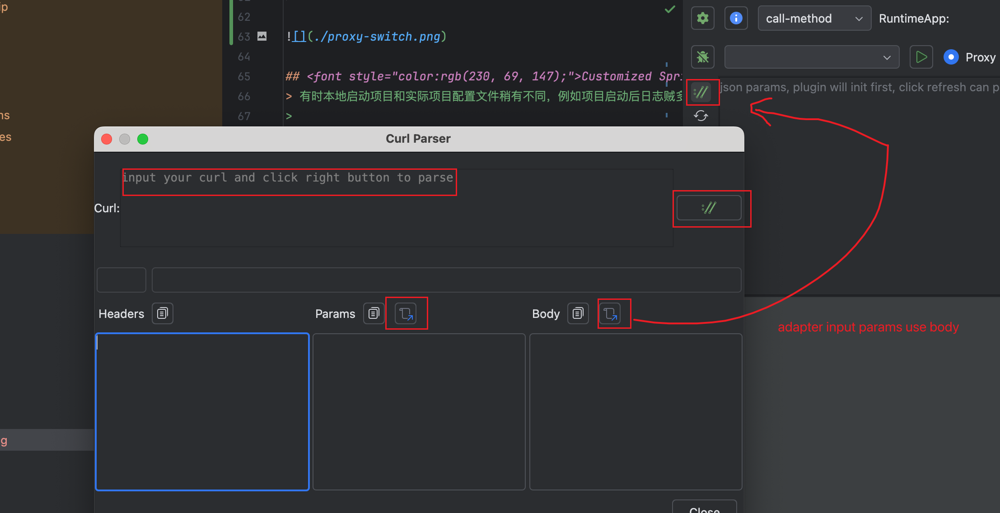

> Fling：想你所想，一步直达，让Spring-Web没有难测的代码。
>

一句话：专注于提高Spring-Boot测试效率的运行时调试插件。

核心理念：BAAS (Bean as a Service)+ Runtime Test

# Quick start(call-method)
> Bean as a Service 
>

[call-method.mp4](./file/call-method.mp4)

## Plugin file
IDEA版本：`2023.2.6+`

[spring-fling-1.0.zip](./file/spring-fling-1.0.zip) 

# flexible-test
> 像脚本语言一样的测试JAVA
>
> 支持Spring-bean注入
>

[flexible-test.mp4](./file/flexible-test.mp4)

# spring-cache
> Spring-Cache扩展较多，对底层不熟悉的开发者搞不明白缓存到底长啥样。
>
> 构建Key + 获取缓存值 + 删除缓存值
>
[spring-cache.mp4](./file/spring-cache.mp4)

# mybatis-sql
> 不依赖本地服务启动
>
> 市面上有构建mybatis-sql的插件，貌似都收费。  
So， 简单写一个
>

[mybatis-sql.mp4](./file/mybatis-sql.mp4)

# Upgrade Ability
## Customized Script
> web架构一般会在controller之前的filter做一些业务拦截，或者登录认证解析，在后续接口中使用，由于直接函数调用会丢掉这部分逻辑，所以导致无法获取用户信息等。
>
> 我们可以在函数调用前后拦截，执行自己的脚本，实现登录态写入，trace写入等逻辑。
>
> 启动类级别独立配置
>
> 支持Spring-bean注入
>
>

## Original Call
> 有时切面代理会影响代码逻辑
>
> 可选式调用原始对象 or 代理对象
>
>

## Customized Spring-Properties
> 有时本地启动项目和实际项目配置文件稍有不同，例如项目启动后日志贼多，大量的mq日志基本不会关注，导致关注的业务日志被淹没。又不好直接修改仓库中文件，所以给了一种覆盖部分配置的能力。
>
> 启动类级别独立配置
>

## Curl Parser
> 接口毕竟是要和前端联调的，现在方法好调用了，整理参数成了一个相对费劲的事情。
>
> curl是一个格式化http请求的通用格式，so 可以解析从各地copy而来的curl，适配到我们的参数框
>

# 修订记录
## 11.19
init
