> Spring-testkit：想你所想，一触直达，让Spring没有难测的代码
>
> 绿色本地化插件，所有配置仅本地保存 `~/.spring-testkit`
>

一句话：专注于提高Spring-Boot研发效率的插件式解决方案。

核心理念：BAAS (Bean as a Service)

# 如何安装？
doc：[Idea 离线安装插件 Idea 安装离线插件_idea离线安装插件-CSDN博客](https://blog.csdn.net/HaHa_Sir/article/details/125086022)

版本：`2023.2+`

插件：[spring-testkit-1.0623.zip](spring-testkit-1.0623.zip)

# 运行时工具
> 依赖运行时项目才可用的工具
>

## Function-call
> Bean as a Service 
>
> 可选式调用原始对象 or 代理对象

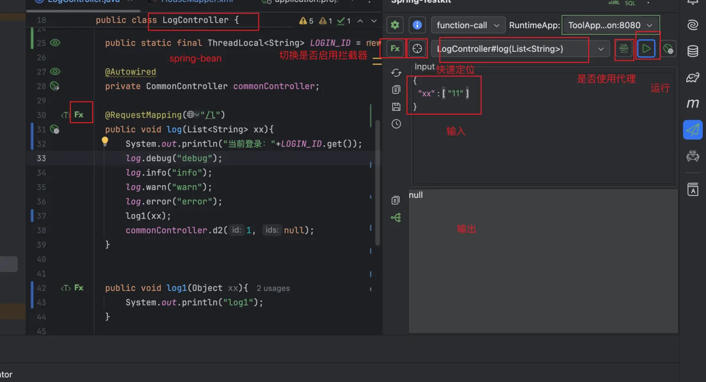

[function-call.mp4](function-call.mp4)

## Flexible-test
> 像脚本语言一样的测试JAVA，采用特有动态编译技术实现代码段随写随测
>
> 支持Spring-bean注入

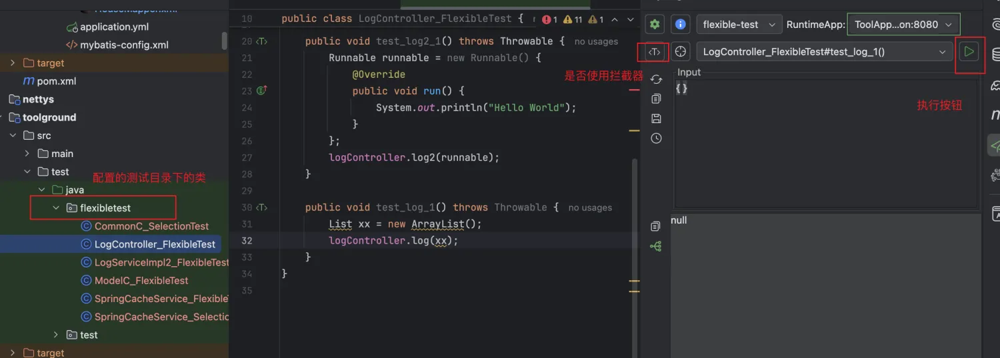

[flexible-test.mp4](flexible-test.mp4)

## Spring-cache
> Spring-Cache扩展较多，对底层不熟悉的开发者搞不明白缓存到底长啥样。
>
> 构建Key + 获取缓存值 + 删除缓存值

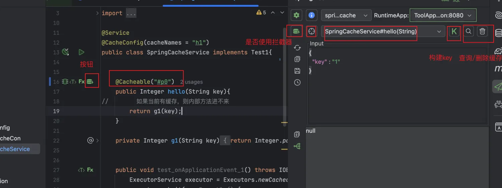

[spring-cache.mp4](spring-cache.mp4)

## 高阶增强
### Tool interceptor
> web架构一般会在controller之前的filter做一些业务拦截，或者登录认证解析，在后续接口中使用，由于直接函数调用会丢掉这部分逻辑，所以导致无法获取用户信息等。
>
> 我们可以在函数调用前后拦截，执行自己的脚本，实现登录态写入，trace写入等逻辑。
>
> 启动类级别独立配置，支持Spring-bean注入

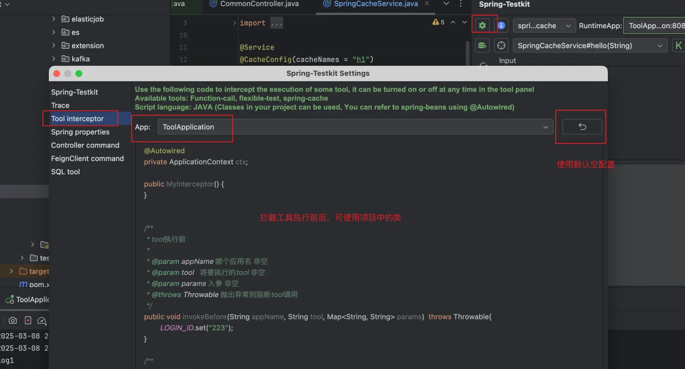

[interceptor.mp4](tool-interceptor.mp4)

### Trace
> 采用字节码增强系统类图化渲染请求链路，请求链路一目了然
>

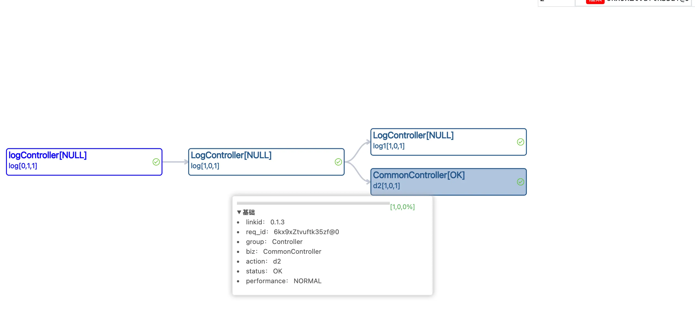

[trace.mp4](trace.mp4)

### View-value
> 快速观测Bean属性值
>
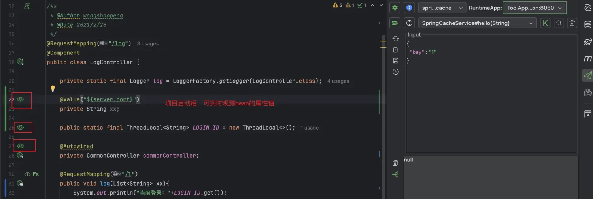

### Customized Spring-properties
> 有时本地启动项目和实际项目配置文件稍有不同，例如项目启动后日志贼多，大量的mq日志基本不会关注，导致关注的业务日志被淹没。又不好直接修改仓库中文件，所以给了一种覆盖部分配置的能力。
>
> 启动类级别独立配置

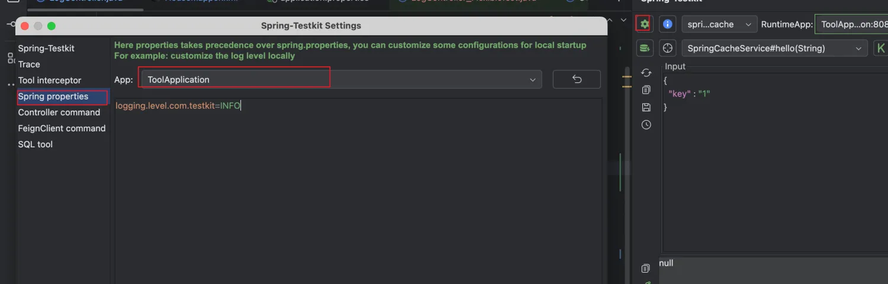

### Testkit-CLI
> 在不侵入系统的CI/CD流程的情况下动态attach运行时jvm提供快速调试的能力
> 
> 类Arthas使用体验
> 
> 命令列表
> `hi` : 查看当前target服务信息
> 
> `view`: 查看property 或者 bean的字段值
> 
> `function-call`: 类插件函数调用
> 
> `flexible-test`: 类插件灵活测试
> 
> `exit`: 临时退出命令行(挂载服务保留)
> 
> `stop`: 停止挂载服务命令

客户端下载：[testkit-cli-1.0.jar](testkit-cli-1.0.jar)

Demo: [testkit-cli.mp4](testkit-cli.mp4)

自由配置快速连接命令：
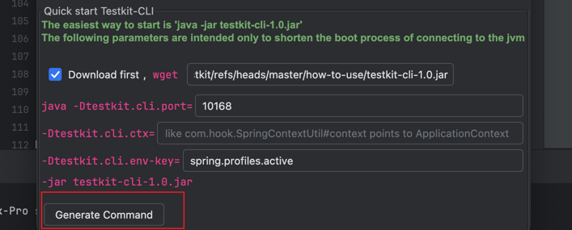

# 静态工具
> 不依赖运行态项目的工具

## Http command
> 1. 多环境测试场景，运行时工具无能为力
> 2. postman等工具无法融入IDEA编码环境，手写参数效率低下

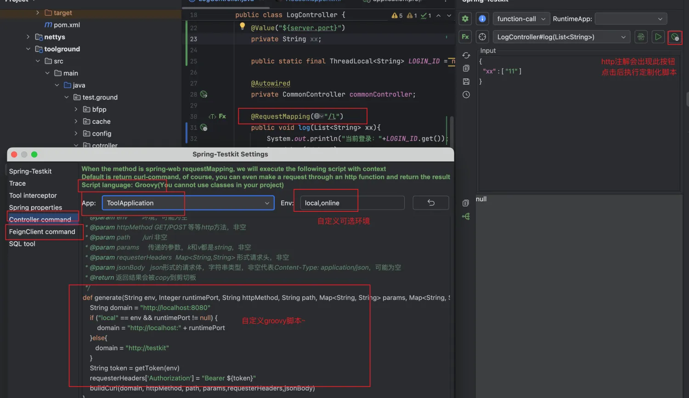

[http-command.mp4](http-command.mp4)

## Mybatis tool & SQL tool
> 利用xml+参数动态生成sql  & sql监测

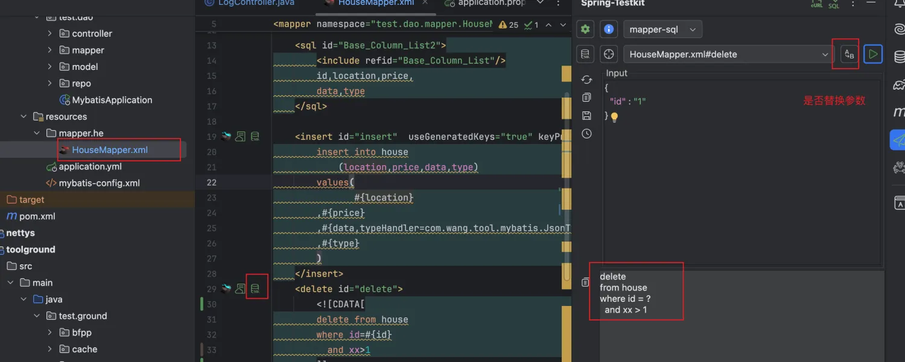
点击右上角按钮打开sql分析
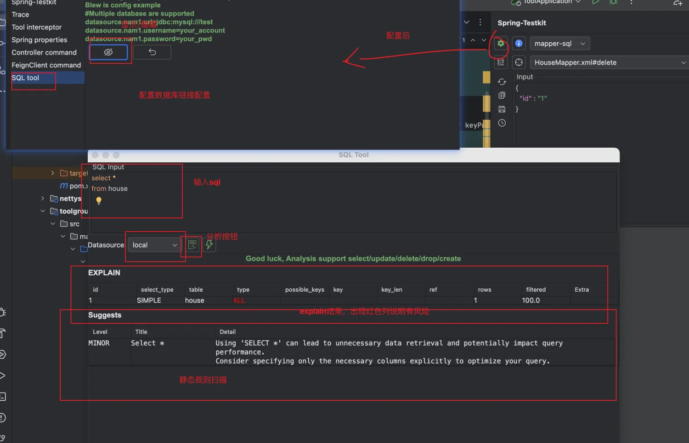

[sql-tool.mp4](sql-tool.mp4)

### Coding guidelines
> 团队研发文档角标式导航触达
>

# 研发支撑
## Curl parser
> 接口毕竟是要和前端联调的，现在方法好调用了，整理参数成了一个相对费劲的事情。
>
> curl是一个格式化http请求的通用格式，so 可以解析从各地copy而来的curl，适配到我们的参数框
>

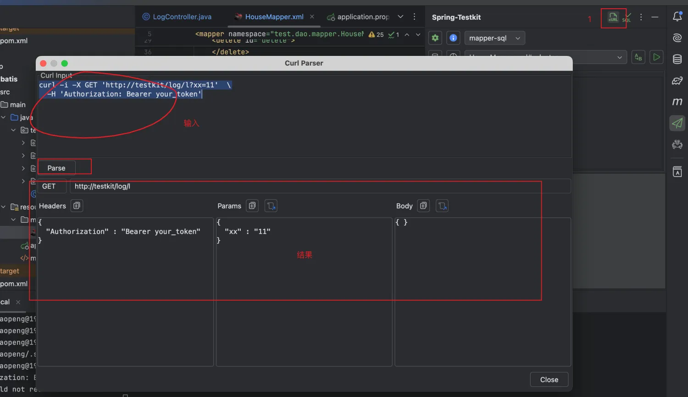
## Req store
> 常用API可以保存后，拿来即用
> 
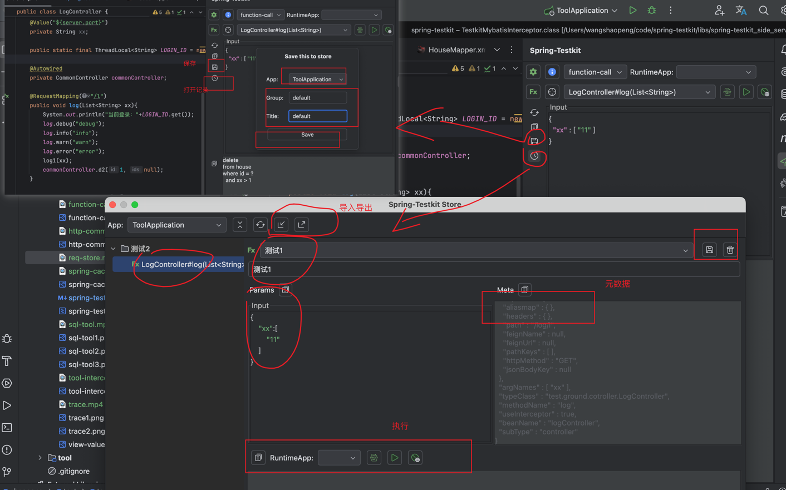
[req-store.mp4](req-store.mp4)

# 修订记录
2025.3.8 公测

2025.4.8 testkit-cli

